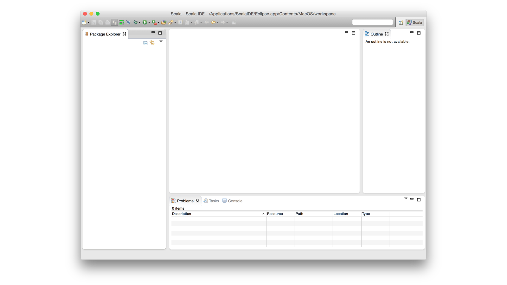
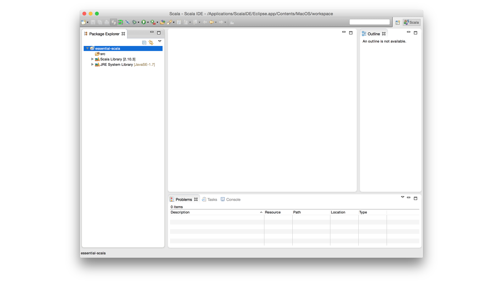
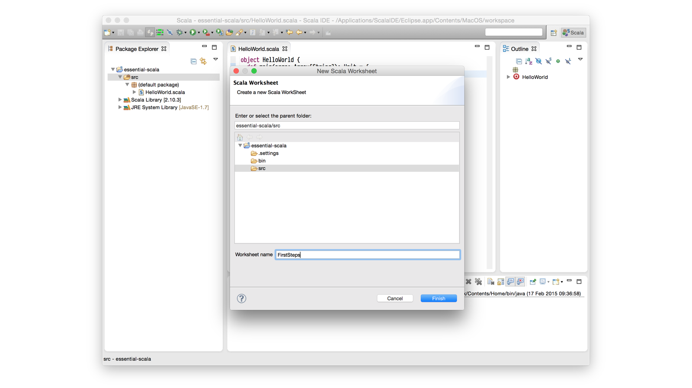
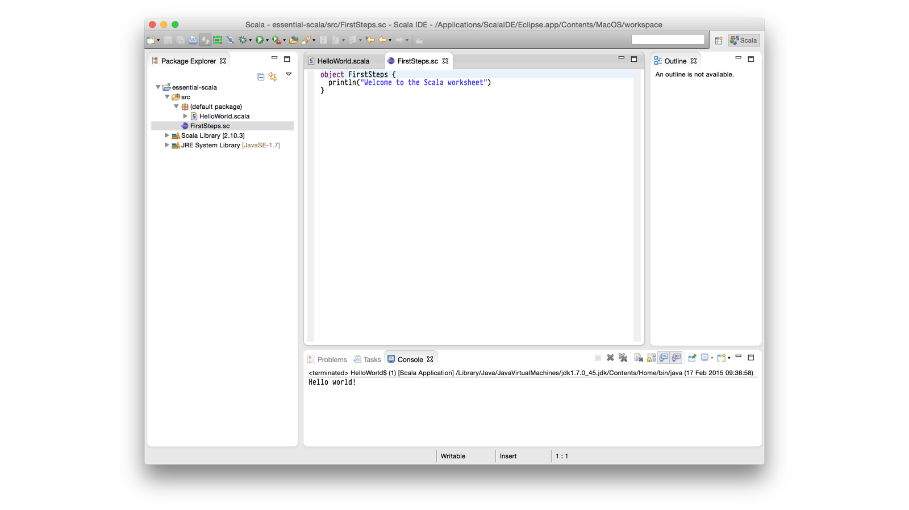

Throughout this course we will be working with short examples of Scala code. We will be working with the *Scala Worksheets* feature of the [Scala IDE] for Eclipse, which you should install before we begin.

[Scala IDE]: http://scala-ide.org

## Setting up Scala IDE

Scala IDE is a plugin that adds Scala programming support to the popular Eclipse IDE. It is also available as a standalone download from [http://scala-ide.org](), which is the way we recommend you obtain it for this course.

Go to [http://scala-ide.org]() now, click *Get the Bundle*, and follow the on-screen instructions to download install the correct version for your operating system:

Once you have downloaded and uncompressed the IDE you should find an application called *Eclipse*. Launch this and choose a folder for your *workspace* (the default suggestion is fine):

You should see an empty workspace window ready for you to start adding beautiful Scala code:

## Creating your first Scala application

Your *workspace* is a folder containing all of the files and settings needed by Eclipse. It is also the focus of the main Eclipse window, where you will be doing most of your Scala programming. Within your workspace you can set up *projects* for each Scala application you work on. We will start by creating a project for your code for the course. Select the **File menu** and choose **New > Scala Project**:

Enter a **Project name** of *core-scala* and click **Finish**. Your workspace should now contain an empty project:

A project is no good without code to run! Let's create our first simple Scala application - the obligatory *Hello World* app. Select the **File Menu** and choose **New > Scala Object...**:

**Name** your object `HelloWorld` and click **Finish**. A new file called `HelloWorld.scala` should appear in the tree view on the left of the main window, and Eclipse should open it in the main editor in the middle:

The main editor should read as follows:

~~~scala
object HelloWorld {

}
~~~

change this text to the following minimalist application:

~~~scala
object HelloWorld {
  def main(args: Array[String]): Unit = {
    println("Hello world!")
  }
}
~~~

Select the **Run Menu** and choose **Run**. This should run your application, resulting in the words `Hello world!` appearing in the *Console* pane at the bottom of the window. Congratulations - you just ran your first Scala application!

## Creating your first Scala Worksheet

While most of our day jobs as developer are spent writing applications, the process of writing an application isn't particularly suitable for a training course scenario. Every time you write a piece of code you need to compile and run the application, which is a significant time sink when added up throughout the day.

Fortunately, Scala IDE allows us to create files called *Scala Worksheets* that are specifically for training and experimentation purposes. Every time you save a Scala Worksheet, Eclipse automatically compiles and runs the code and inserts the output on the right-hand side of your editor. This provides instant feedback, which is exactly what we need!

Create your first Scala Worksheet by selecting the **File Menu** and choosing **New > Scala Worksheet**:

Enter a **Worksheet name** of `FirstSteps` and click **Finish**. A new file called `FirstSteps.sw` should appear in the tree view on the left of the main window, and should open it in the main editor in the middle:

Note that the object on the left contains a single line of Scala code:

~~~scala
println("Welcome to the Scala worksheet")
~~~

for which Eclipse is displaying the corresponding output on the right:

~~~
Welcome to the Scala worksheet
~~~

Any expression you add to the left of the editor is evaluated and printed on the right. To demonstrate this, change the text in the editor to the following:

~~~scala
object FirstSteps {
  println("Welcome to the Scala worksheet")

  1 + 1

  if(20 > 10) "left" else "right"

  println("The ultimate answer is " + 42)
}
~~~

Save your work by selecting the **File Menu** and choosing **Save**. Eclipse should automatically evaluate each line of code and print the results on the right of the editor:

~~~scala
object FirstSteps {
  println("Welcome to the Scala worksheet")   //> Welcome to the Scala worksheet

  1 + 1                                       //> res0: Int(2) = 2

  if(20 > 10) "left" else "right"             //> res1: String = left

  println("The ultimate answer is " + 42)     //> The ultimate answer is 42
}
~~~

We'll dive into what all of the text on the right means as we proceed with the course ahead. For now you're all set to start honing your Scala skills!
